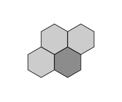

======
Basalt
======

Basalt is a Python meshing library for nuclear workflows. It wraps the
commercial `Simmetrix SimModSuite <https://www.simmetrix.com/>`__
library through C++ bindings, ingests Parasolid CAD assemblies,
performs non-manifold imprinting, generates surface and volume
meshes, and exports them as Gmsh ``.msh`` files annotated for use
with `Stellarmesh <https://github.com/Thea-Energy/stellarmesh>`__
and DAGMC.

.. note::

   Basalt requires a valid `Simmetrix SimModSuite
   <https://www.simmetrix.com/>`__ license and the corresponding
   module distribution (``gmcore``, ``mscore``, ``pskrnl``,
   ``simlicense``). The library cannot be built or run without
   these. See `Installation <install.html>`__ for details.

**Features**

* Parasolid (``.x_t``) assembly import via Simmetrix
* NX user-attribute ingestion through a JSON sidecar
* Non-manifold imprint and merge of conformal geometry
* Surface and volume meshing with curvature and proximity refinement
* Gmsh export with metadata for downstream DAGMC conversion

---------------
Getting Started
---------------

* `Installation <install.html>`__
* `Usage <usage.html>`__
* `API <api.html>`__

-------
Example
-------

.. code:: python

   import basalt as bslt

   model = bslt.Model.from_parasolid_file("geometry.x_t")
   nm_model = model.make_non_manifold_model()
   mesh_case = bslt.MeshCase(nm_model)
   mesh_case.set_size(0.1)
   surface_mesh = bslt.SurfaceMesh.from_model(nm_model, mesh_case)
   volume_mesh = bslt.VolumeMesh.from_surface_mesh(surface_mesh)
   volume_mesh.write_gmsh("output.msh")

----------------
Acknowledgements
----------------

basalt is originally a project of Thea Energy, who are building the
world's first planar coil stellarator.

.. figure:: https://github.com/user-attachments/assets/37b9ba1c-b22c-4837-b226-a6212854127e
   :width: 200px
