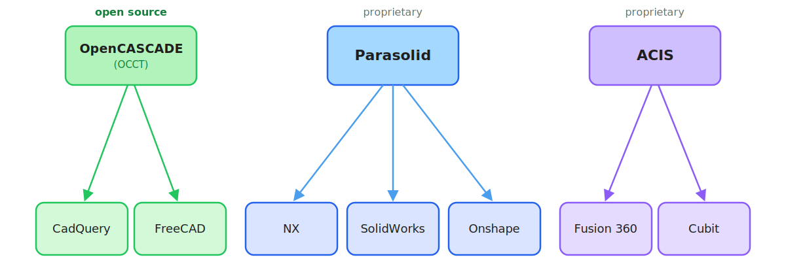
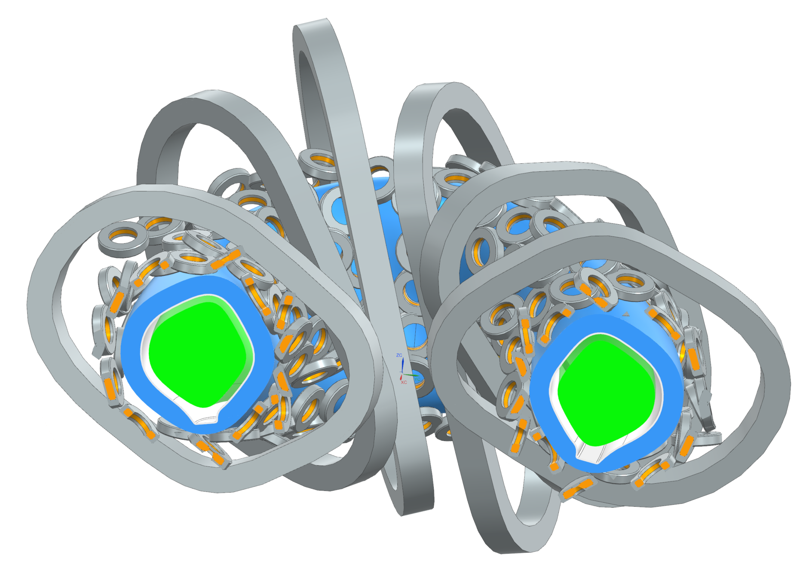

======================
Meshing for neutronics
======================

Turning a CAD assembly into a transport-ready mesh is the hard part of a
neutronics workflow. Four constraints dominate:

#. **No overlaps.** Overlapping volumes have undefined material where they
   intersect, so the transport solver cannot run.
#. **Shared-surface topology.** Touching volumes must share one conformal
   boundary surface, not two coincident copies, or particles leak between them.
#. **Metadata.** Cells, materials, and surface senses must survive every stage
   from CAD to transport.
#. **Performance.** Element count must stay low enough to solve while still
   resolving the geometry.

Why a dedicated kernel
======================

The open-source meshing stack is built on the OpenCASCADE (OCC) geometry
kernel. OCC handles code-defined geometry well, but does not scale to the
models engineers build in industrial CAD — NX, SolidWorks, CATIA — and least
of all to stellarators. Those models are authored in, and exported from,
commercial tools built on the proprietary Parasolid and ACIS kernels.

   *Geometry kernels and the CAD tools built on them. The open stack uses
   OpenCASCADE; most industrial CAD is built on Parasolid or ACIS.*

   *A 705-body stellarator assembly modelled in Siemens NX — beyond what the
   OCC kernel handles.*

Where Basalt fits
=================

Basalt meshes industrial Parasolid CAD through the commercial `Simmetrix
SimModSuite <https://www.simmetrix.com/>`__ kernel, then exports a Gmsh mesh
annotated for `Stellarmesh <https://github.com/Thea-Energy/stellarmesh>`__ and
DAGMC. It resolves overlaps and shared surfaces while imprinting (:doc:`usage`),
gives fine control over element sizing (:doc:`meshing`), and carries CAD
metadata through to the DAGMC tags (:doc:`nx`).
