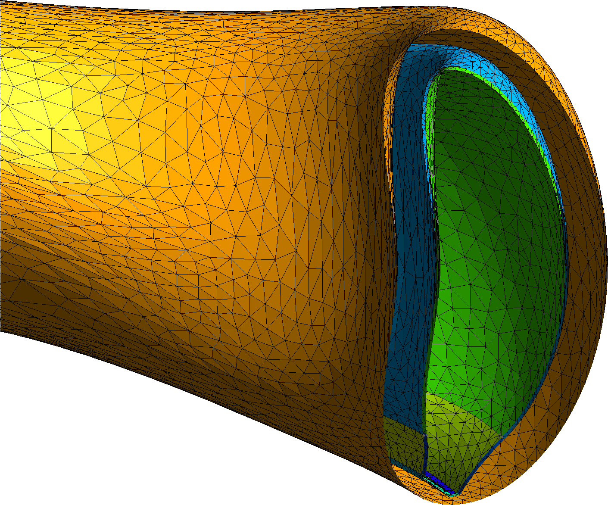
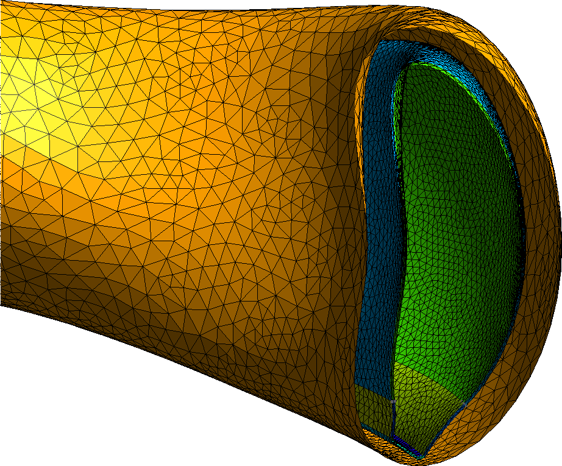
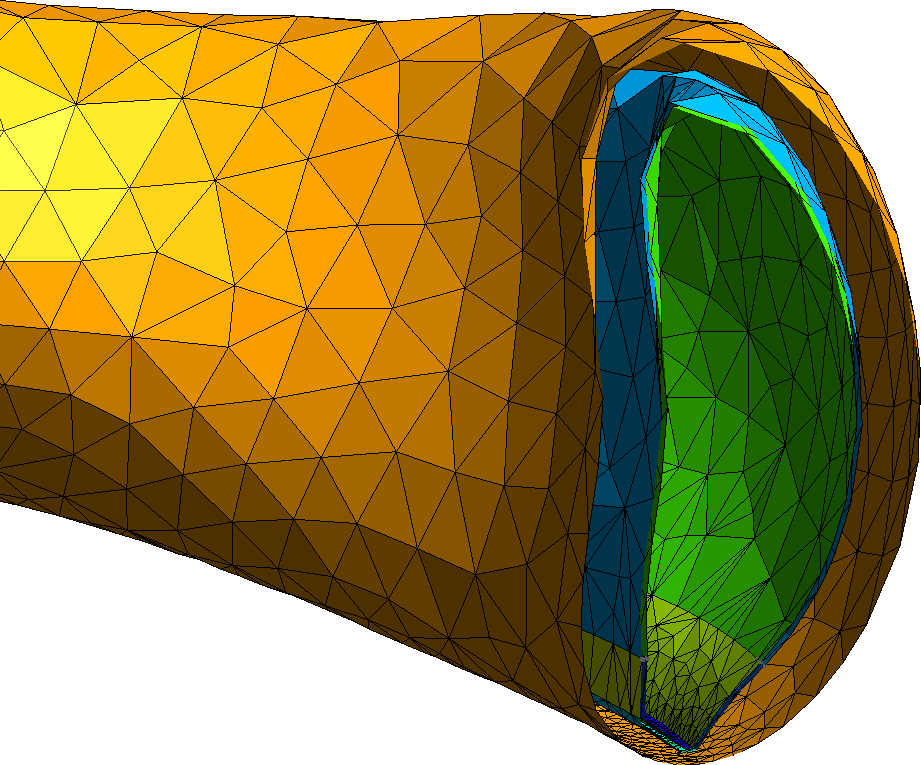
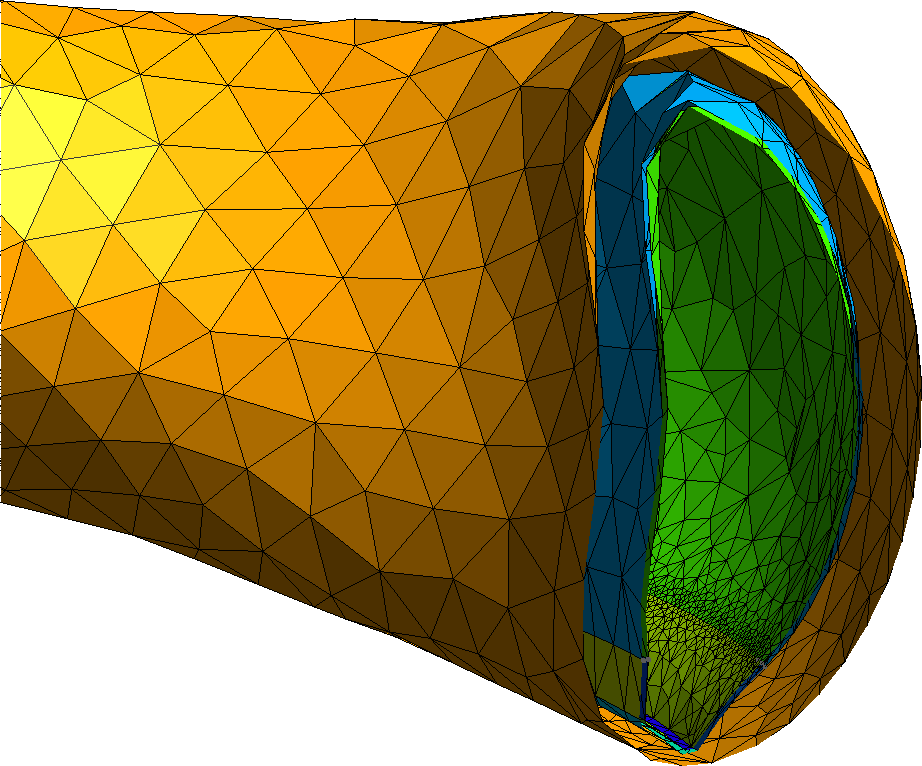
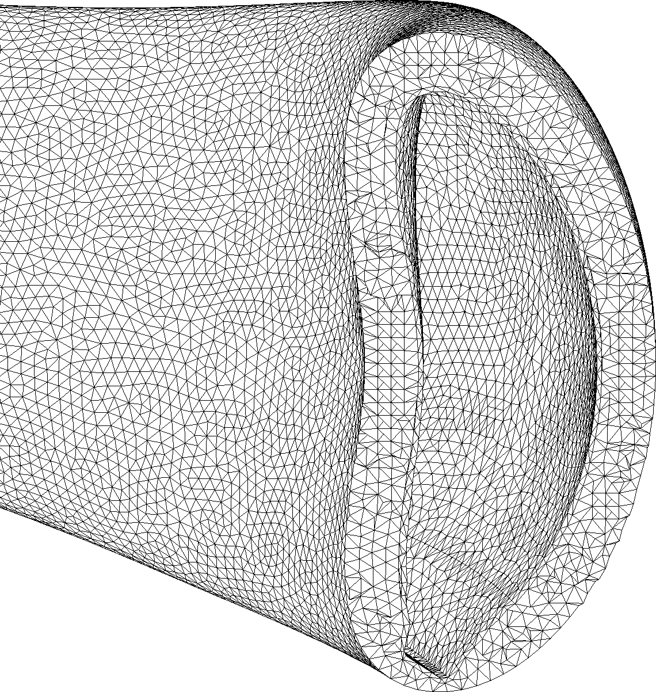

============
Mesh control
============
.. module:: basalt
   :no-index:

Every refinement below is a method on :py:class:`MeshCase`. Set the controls,
then build the surface and volume meshes:

.. code:: python

   import basalt as bslt

   mesh_case = bslt.MeshCase(nm_model)
   mesh_case.set_size(0.05)                 # coarse baseline
   # ... refinements ...
   surface_mesh = bslt.SurfaceMesh.from_model(nm_model, mesh_case)
   volume_mesh = bslt.VolumeMesh.from_surface_mesh(surface_mesh)

Most controls accept a ``model_item`` to scope the setting to a single
:py:class:`Region`, :py:class:`Face`, or :py:class:`Edge` instead of the whole
model.

Element size
============

:py:meth:`MeshCase.set_size` sets the baseline. Sizes are **relative by
default** — a fraction of the target's bounding-box diagonal. Pass
``relative=False`` for an absolute size in model units.

.. code:: python

   mesh_case.set_size(0.05)                  # 5% of the bbox diagonal
   mesh_case.set_size(0.02, relative=False)  # 0.02 m

Surface tolerance
=================

Refine by surface curvature so curved faces stay smooth. Make elements
**anisotropic** to stretch them along the low-curvature direction.

.. code:: python

   mesh_case.set_curvature_refinement(0.01, relative=True, anisotropic=True)

   *Curvature refinement: smaller elements where the surface bends.*

Proximity refinement
====================

Drive element size by distance to nearby surfaces, keeping thin gaps and narrow
channels resolved. The in-gap size is ``thickness / value``.

.. code:: python

   mesh_case.set_proximity_refinement(2.0)  # ~2 elements across a gap

   *Proximity refinement resolving a thin gap between bodies.*

Local gradation
===============

Seed a finer size on one face, edge, or region; elements grow smoothly back to
the baseline.

.. code:: python

   mesh_case.set_size(0.05)                       # coarse everywhere
   face = nm_model.faces[FACE_ID]                 # a face to seed
   mesh_case.set_size(0.01, model_item=face)      # fine on that face

   *A fine size seeded on one face, grading into the surrounding mesh.*

The same call seeds an edge or region:

.. code:: python

   edge = nm_model.edges[EDGE_ID]
   mesh_case.set_size(0.004, model_item=edge)

   *The same control applied to a single edge.*

Volume meshing
==============

The controls above shape the surface mesh; two more act on the **volume**
interior. A per-region size (``set_size(model_item=region)``) grades the volume
tetrahedra between bodies, and a point refinement seeds a fine size anywhere in
space — useful for a point of interest with no CAD entity to anchor to. Pass
``enforce_size=1`` so the mesher honours these interior sizes; with the default
the interior may stay coarser than requested.

.. code:: python

   mesh_case.set_size(0.3)                              # coarse baseline
   mesh_case.add_point_refinement(0.03, [4.43, 0, 0])  # fine around a point
   mesh_case.set_gradation_rate(0.3)                   # slow, smooth spread

   surface_mesh = bslt.SurfaceMesh.from_model(nm_model, mesh_case)
   volume_mesh = bslt.VolumeMesh.from_surface_mesh(surface_mesh, enforce_size=1)

   *A graded volume mesh through the part interior.*
