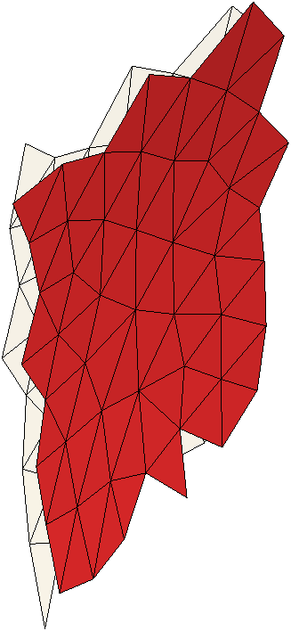
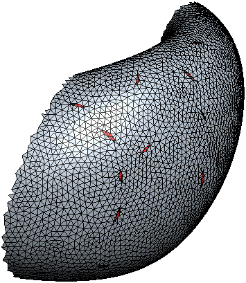
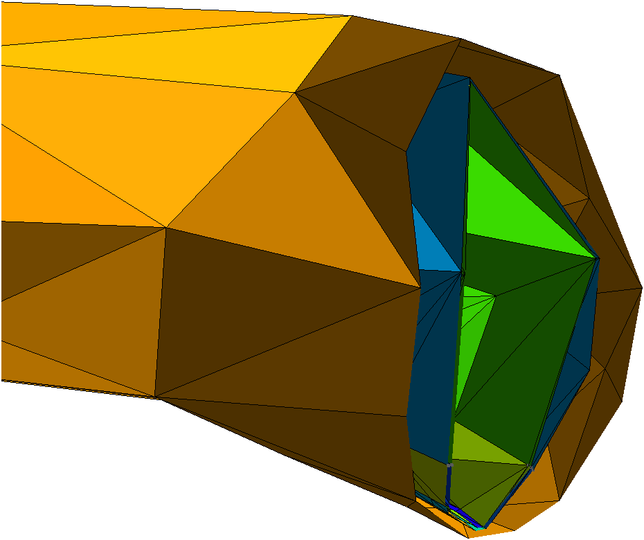

=====
Usage
=====
.. module:: basalt
   :no-index:

Basalt transforms a Parasolid CAD assembly into a Gmsh mesh annotated
for downstream DAGMC conversion. The pipeline has five distinct
stages, each modelled by a small set of classes.

==================  ==========================================
Stage               Basalt entry point
==================  ==========================================
Parasolid → GAM     :py:meth:`Model.from_parasolid_file`
GAM → SMS           :py:meth:`Model.translate`
SMS → non-manifold  :py:meth:`Model.make_non_manifold_model`
Mesh                :py:class:`MeshCase`, :py:class:`SurfaceMesh`,
                    :py:class:`VolumeMesh`
Export              :py:meth:`Mesh.write_msh`
==================  ==========================================

------------------------
Loading a Parasolid file
------------------------

.. code:: python

   import basalt as bslt

   model = bslt.Model.from_parasolid_file("geometry.x_t")

Pass ``load_nx_attrs=True`` to auto-detect a sibling ``*_attrs.json``
sidecar (produced by the NX export journal) and apply its component
attributes — including ``DB_PART_NAME``, used later as the material
name — to each :py:class:`Part` and :py:class:`Assembly`.

NX exports collapse all instances of the same base part into a single
GAM assembly. A part referenced 332 times in NX appears as one
:py:class:`Assembly` containing 332 anonymous child :py:class:`Part`
objects in Basalt. Per-instance NX names are not preserved.

--------------------------
Translating and imprinting
--------------------------

GAM is the assembly model; SMS is the model SimModSuite can mesh.
Two calls bridge them:

.. code:: python

   import basalt as bslt

   sms_model = model.translate()
   nm_model = sms_model.make_non_manifold_model()

:py:meth:`Model.translate` validates the geometry; invalid faces raise
here. :py:meth:`Model.make_non_manifold_model` boolean-imprints
shared faces between adjacent volumes so the final mesh is
conformal.

Conformal meshing & overlaps
----------------------------

:py:meth:`Model.make_non_manifold_model` resolves how adjacent bodies meet, so
the mesh is conformal regardless of how the CAD was authored:

* **Touching → one shared face.** Coincident faces merge into a single
  conformal face shared by both volumes — non-manifold, not duplicated.
* **Overlapping → new faces and regions.** Where bodies truly overlap, the
  imprint creates new regions at the intersection.
* **Coarse → still conformal.** Adjacent bodies never self-intersect, even at
  coarse mesh sizes.

   *Touching bodies share one conformal face (red).*

   *A true overlap imprints new regions (red).*

   *The shared interface stays conformal even at coarse sizes.*

-------
Meshing
-------

.. code:: python

   import basalt as bslt

   mesh_case = bslt.MeshCase(nm_model)
   mesh_case.set_size(0.1)
   mesh_case.set_curvature_refinement(0.5, relative=True)
   mesh_case.set_proximity_refinement(2.0)

   surface_mesh = bslt.SurfaceMesh.from_model(nm_model, mesh_case)
   volume_mesh = bslt.VolumeMesh.from_surface_mesh(surface_mesh)

Each refinement method accepts an optional ``model_item`` argument to
apply the setting to a single :py:class:`Part`, :py:class:`Region`, or
:py:class:`Face` rather than the whole model.

See :doc:`meshing` for the full set of refinement controls.

.. seealso::

   Basalt's meshing controls wrap the Simmetrix SimModSuite mesher. For the
   full parameter semantics and meshing theory, consult the Simmetrix
   SimModSuite documentation that ships with your SimModSuite distribution.

------------------
Writing for DAGMC
------------------

.. code:: python

   import basalt as bslt

   volume_mesh.write_msh("output.msh")

The exporter writes one Gmsh discrete entity per SMS mesh entity and
encodes per-entity metadata in URL-style physical-group names:

* Volumes: ``tag=<N>&material=<material_name>``
* Surfaces: ``tag=<N>&forward_volume=<V>&reverse_volume=<V>``

Material names are resolved per region in this order:

1. ``DB_PART_NAME`` native attribute on the related :py:class:`Part`.
2. :py:attr:`Part.name` (usually ``None`` for child bodies).
3. Parent :py:attr:`Assembly.name`.

A ``material_namer`` callback can override this resolution. Names
must be ≤ 28 characters — a hard MOAB limit downstream.

See :doc:`format` for the full producer-side reference, including the
slug-vs-material distinction and unit conventions.

-------
Helpers
-------

:py:func:`print_hierarchy` walks a :py:class:`Model` and prints its
assembly/part/region tree:

.. code:: python

   import basalt as bslt

   bslt.print_hierarchy(model)

:py:func:`load_material_metadata` reads a v6 ``_attrs.json`` sidecar
and returns ``{material_slug: body_record}`` for use when wiring up
materials downstream:

.. code:: python

   import basalt as bslt

   metadata = bslt.load_material_metadata("geometry_attrs.json")
